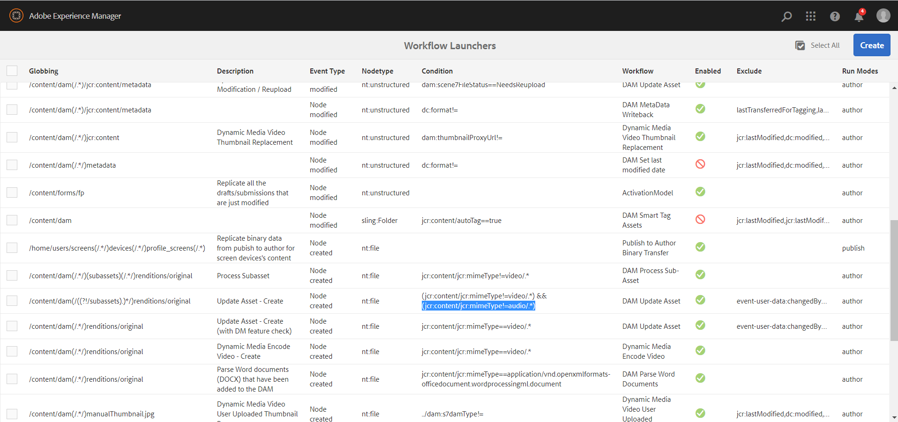
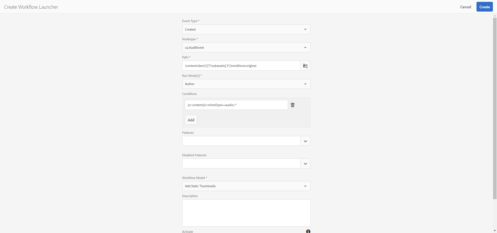

# Add Static Thumbnails for Audio Fields

Add following configurations:
1. Apache Sling Service User Mapper Service Ammendment:

2. Change Exisitng Update Asset Launcher and add one more condition:
(jcr:content/jcr:mimeType!=audio/.*)

3. Add new Update Asset Launcher for audio files:

## Modules

The main parts of the template are:

* core: Java bundle containing all core functionality like OSGi services, listeners or schedulers, as well as component-related Java code such as servlets or request filters.
* ui.apps: contains the /apps (and /etc) parts of the project, ie JS&CSS clientlibs, components, templates, runmode specific configs as well as Hobbes-tests

## How to build

To build all the modules run in the project root directory the following command with Maven 3:

    mvn clean install

If you have a running AEM instance you can build and package the whole project and deploy into AEM with  

    mvn clean install -PautoInstallPackage
    
Or to deploy it to a publish instance, run

    mvn clean install -PautoInstallPackagePublish
    
Or alternatively

    mvn clean install -PautoInstallPackage -Daem.port=4503

Or to deploy only the bundle to the author, run

    mvn clean install -PautoInstallBundle

## Testing

There are three levels of testing contained in the project:

* unit test in core: this show-cases classic unit testing of the code contained in the bundle. To test, execute:

    mvn clean test

* server-side integration tests: this allows to run unit-like tests in the AEM-environment, ie on the AEM server. To test, execute:

    mvn clean verify -PintegrationTests

* client-side Hobbes.js tests: JavaScript-based browser-side tests that verify browser-side behavior. To test:

    in the browser, open the page in 'Developer mode', open the left panel and switch to the 'Tests' tab and find the generated 'MyName Tests' and run them.

## Maven settings

The project comes with the auto-public repository configured. To setup the repository in your Maven settings, refer to:

    http://helpx.adobe.com/experience-manager/kb/SetUpTheAdobeMavenRepository.html
